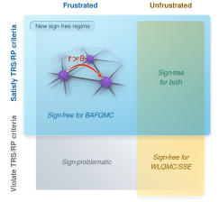

<div align="center" markdown="1">

# BAFQMC

### 从局域正性到全局对称性

**玻色辅助场量子蒙特卡洛**

[English](../../README.md) · **简体中文**

[](https://github.com/YinkaiYu/BAFQMC/actions/workflows/reproduce-benchmarks.yml)
[](https://github.com/YinkaiYu/BAFQMC/blob/main/LICENSE)
[](#论文)
[](./development.md)
[](./agents.md)

[在线文档](https://www.yykspace.com/BAFQMC/zh/) · [开始使用](./getting-started.md) · [算法与约定](./algorithm.md) · [复现结果](./benchmarks-paper-readme.md) · [Agent 指南](./agents.md)

</div>

世界线和随机级数展开方法围绕局域矩阵元正性构造无符号采样。
**BAFQMC 通过 Hubbard–Stratonovich 解耦后的全局对称性，建立玻色体系蒙特卡洛权重的非负性。**
反射正性（RP）与时间反演对称性（TRS）由此打开新的可计算区域：
受这些对称性保护的阻挫玻色体系。

<p align="center" markdown="1">
  
</p>

这个仓库提供这一构造的完整实现：三角晶格双组分玻色体系的有限温求解器，
包含粒子数守恒与在位配对两种情形；精确对角化（ED）参考程序；以及完整的论文 benchmark 复现流程。
**开展新的计算，扩展算法，继续构建。** 仓库采用 [MIT 协议](https://github.com/YinkaiYu/BAFQMC/blob/main/LICENSE) 开放。

## 可以模拟什么？

现有求解器计算**周期边界三角晶格上双组分玻色体系**的有限温性质。
沿用论文的记号，主 benchmark 的哈密顿量为

```math
\begin{aligned}
\hat H ={}&t\sum_{\langle ij\rangle}
\left(\hat b_i^+\hat b_j+\hat b_j^+\hat b_i
+\hat c_i^+\hat c_j+\hat c_j^+\hat c_i\right)\\
&-\sum_i\left(\Delta\,\hat b_i^+\hat c_i^+
+\Delta^*\,\hat b_i\hat c_i\right)
+U\sum_i\left(\hat n_{b,i}-\hat n_{c,i}\right)^2.
\end{aligned}
```

这里 $`\hat n_{b,i}=\hat b_i^+\hat b_i`$、
$`\hat n_{c,i}=\hat c_i^+\hat c_i`$。
模拟采用巨正则系综 $`Z=\mathrm{Tr}e^{-\beta(\hat H-\mu\hat N)}`$，
其中 $`\hat N=\sum_i(\hat n_{b,i}+\hat n_{c,i})`$。
**正跃迁 $`t=1`$ 对应阻挫情形。** 粒子数守恒求解器取 $`\Delta=0`$；
Nambu 求解器支持实数在位配对。

晶格包含 $`N_s=L_xL_y`$ 个格点，原胞基矢为

```math
\mathbf a_1=(1,0),\qquad
\mathbf a_2=\left(\frac12,\frac{\sqrt3}{2}\right).
```

最近邻键沿 $`\mathbf a_1`$、$`\mathbf a_2`$ 和 $`\mathbf a_2-\mathbf a_1`$
三个方向，包含反向跃迁与周期镜像。Benchmark 使用 $`3\times3`$ 晶格，
测量 $`\rho`$、$`-E`$、$`S_{\mathrm{SF}}(K)`$ 和 $`S_{\mathrm{DW}}(K)`$。

代码还实现了补充材料使用的两个密度相互作用通道：

```math
\hat H_U=\sum_i\left[
U_1(\hat n_{b,i}+\hat n_{c,i})^2
+U_2(\hat n_{b,i}-\hat n_{c,i})^2\right],
\qquad U_1\leq0,\quad U_2\geq0.
```

论文主模型对应 $`U_1=0`$、$`U_2=U`$。输入的配对强度就是论文中的实数
$`\Delta`$；代码采用等价的算符相位 $`c_{\mathrm{code}}=-c_{\mathrm{paper}}`$。
[模型、晶格与参数指南](./algorithm.md)说明了这一对应关系、统计系综和参考计算。

**想研究其他模型？** [模型扩展指南](./model-development.md)和专用 Agent 技能
覆盖晶格、跃迁、相互作用与配对项的扩展，以及配套 ED 和物理测试。

## 和你的 Agent 一起使用

克隆仓库，在你习惯的编码 Agent 中打开它。
[Agent 指令](./agents.md)和[任务指南](./agent-workflows.md)已经准备好代码地图、
物理约定、运行命令和验证方法。你可以直接这样发起任务：

```text
阅读 AGENTS.md，在 Linux 或 WSL 中配置 BAFQMC，完成小规模 BAFQMC + ED
安装检查，并告诉我结果在哪里。
```

```text
完整复现论文的所有 benchmark。使用原始参数和种子，将新结果保存在独立目录中，
完成后给我看两张图。
```

```text
我想研究 U = 1、beta = 4、mu = -5 时，三角晶格模型随配对强度的变化。
请准备独立的扫描任务，先用 ED 检查一个小规模算例，并在正式计算前说明资源需求。
```

```text
将论文主模型推广到最近邻 kagome 晶格，取 t = 1、U = 1、Delta = 0、
beta = 4、mu = -5。请阅读新模型开发技能，推导 HS 对称性，实现晶格、
对应的 ED 和观测量，先完成小体系验证，并在正式计算前说明资源需求。
```

```text
为我的研究添加一个可观测量。按照现有 Green 函数约定推导估计量，
在 BAFQMC 和 ED 中实现，并在小体系上验证。
```

告诉 Agent 你要研究的物理问题和可用计算资源，它可以沿着技术指南完成具体工作。

## 完整复现论文

完成[环境配置](./getting-started.md)后，运行：

```bash
python3 reproduce.py
```

这一条命令会编译求解器，为**全部 22 个 benchmark 点**重新运行 BAFQMC 和 ED，
处理新产生的测量数据，并生成两张图。
在现代桌面 CPU 上，请预留约 **12–24 小时**、**16 GiB 内存**和 **8 GiB 可用磁盘空间**。
默认使用一个 MPI 进程、一个数值库线程，按顺序计算各参数点。
[资源指南](./benchmarks-paper-resources.md)给出了实测时间和中断后的续跑方法。

```bash
python3 reproduce.py --plan        # 查看计算范围和资源估计
python3 reproduce.py --mode smoke  # 小规模 BAFQMC + ED 安装检查
```

仓库包含用于绘图的小型处理后数据，包括平均值和均值标准误。
大型模拟输出由程序在本地生成，不进入 Git 跟踪。

## 进一步探索

- [开始使用](./getting-started.md)：安装、运行以及查看结果。
- [算法与物理约定](./algorithm.md)：模型、对称性和可观测量。
- [物理观测量与输出](./observables.md)：算符定义、归一化与文件对应。
- [扩展到其他模型](./model-development.md)：从哈密顿量到经过验证的实现。
- [Agent 科研任务指南](./agent-workflows.md)：新计算与算法扩展。
- [Benchmark 细节](./benchmarks-paper-readme.md)：参数、数据与复现模式。
- [参与开发](./contributing.md)：实现和验证你的贡献。

<a id="论文"></a>

## 论文

arXiv：**2609.XXXXX**（待更新编号）。
